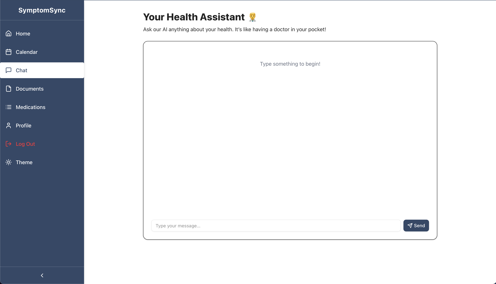

# A Health Management Web App 💊

Build with patient care in mind, SymptomSync is a web application designed to help users manage their health and wellness. It provides a comprehensive dashboard for tracking medications, appointments, and health logs, all while ensuring real-time synchronization across devices. With features like medication reminders, appointment tracking, and an AI-powered chatbot, SymptomSync empowers users to take control of their health journey.

> [!IMPORTANT]
> **Live Web App: [https://symptomsync.vercel.app](https://symptomsync.vercel.app) 🚀**

---

## SymptomSync UI

The UI of the app was designed with Figma and Tailwind CSS. The design is responsive and mobile-first, ensuring a seamless experience across devices. Below are some screenshots of the app in action:

### Home Dashboard


### Calendar View


### Documents Page


### Medication Reminders


### Chatbot UI

<p align="center">
  
</p>


### Auth

<p align="center">
  
</p>


## Features

SymptomSync offers a range of features to help users manage their health effectively:

- **Medication Reminders**: Schedule, edit, and delete recurring or one‑off med alerts.
  - **QR/Barcode Scanning**: Scan medication QR codes to auto-fill details. This can save time and reduce errors when entering medication information!
- **Appointment Tracking**: Log upcoming appointments with date/time and manage them.
- **Health Logs**: Record symptoms, mood, vitals, and notes; visualize trends over time.
- **Dashboard Visualizations**: Interactive charts for severity trends, symptom & mood distribution, and more.
- **Real‑Time Updates**: Broadcast channel notifications and Supabase Realtime keep all devices in sync instantly.
- **Pagination**: Efficient paginated fetching for large datasets (meds, appts, logs).
- **Notifications**: In-app reminders for due medications and appointments.
- **ICS Export/Import**: Export all events as an ICS calendar file or import from external calendars.
- **Calendar View**: Month/week/day/agenda views for all events, with drag-and-drop support.
- **Documents Page**: Upload/export and manage documents related to health records, prescriptions, etc.
- **Chatbot**: AI-powered chatbot for symptom analysis and health insights.
- **User Profiles**: Create and manage user profiles with personalized settings.
- **Medication Schedules**: Set up complex medication schedules with reminders.
- **Login/Signup**: Secure authentication via Supabase Auth.
- **Reset Password**: Password reset functionality for user accounts.
- **Dark Mode**: Toggle between light and dark themes for better accessibility.
- **Responsive Design**: Mobile-first design with a focus on usability across devices.

---

## Tech Stack

- **Front-End**
  - Next.js & React (TypeScript)
  - Tailwind CSS & Shadcn/ui components
  - Framer Motion for animations
  - react-chartjs-2 & Chart.js for charts
  - react-query for data fetching & caching
  - react-calendar for calendar view
  - lucide-icons for icons
- **Back-End / Data**
  - Supabase (Auth, Postgres, Realtime, Storage, Cron)
- **Notifications & Sync**
  - Supabase Postgres Triggers for real-time updates
  - Supabase Cron Jobs for scheduled reminders
  - Supabase Broadcast Channels & `postgres_changes` for live updates & notifications

---

## Architecture Overview

```
┌──────────────────┐                   ┌───────────────────────┐
│  Next.js Client  │ <––– WebSocket –> │   Supabase Realtime   │
│ - React Pages    │                   │ - postgres_changes    │
│ - UI Components  │                   │ - broadcast channels  │
│ - TailwindCSS    │                   └───────────────────────┘
│ - React Query    │
└──────────────────┘
         ↑
         │
         │ REST
         ↓
┌──────────────────┐
│   Supabase API   │
│ - Auth           │
│ - Functions      │
│ - Database       │
│ - Storage        │
│ - Cron Jobs      │
│ - Triggers       │
│ - RLS Policies   │
└──────────────────┘
```

- **Supabase**: The backend is powered by Supabase, which provides a Postgres database, authentication, and real-time capabilities.
  - Each table is protected by **Row Level Security (RLS)** policies to ensure user data isolation, so that users can only access/update/delete their own data.
- **Realtime Broadcast**: Any create/update/delete triggers both a `postgres_changes` subscription and a broadcast message so all open clients show a toast notification.
- **Cron Jobs**: Scheduled jobs (via Supabase Cron) that scan upcoming reminders and dispatch notifications every second.


## Installation

1. Clone the repo

   ```bash
   git clone https://github.com/hoangsonww/SymptomSync-Health-App.git
   cd SymptomSync-Health-App
   ```

2. Open the project in your favorite code editor (e.g., VSCode). When prompted by your IDE, select "Open in Container" to open the project in a Docker container. Alternatively, if using VSCode, you can use the Remote - Containers extension to open the project in a container.
   - This is very important as the project uses Docker to run the database and other services. If you don't have Docker installed, please install it first.
3. Install dependencies (Remember to use `--legacy-peer-deps` if you encounter issues with React versions being incompatible with Shadcn/ui)
   ```bash
   npm install --legacy-peer-deps
   ```
4. Copy `.env.example` → `.env.local` and fill in your Supabase credentials
   ```bash
   NEXT_PUBLIC_SUPABASE_URL=…
   NEXT_PUBLIC_SUPABASE_ANON_KEY=…
   NEXT_PUBLIC_GOOGLE_AI_API_KEY=…
   ```
5. Run the dev server
   ```bash
   npm run dev
   ```

---

## Configuration

- **Supabase**

  - Configure **Auth** settings in the Supabase dashboard
    - Enable email/password signups
    - Uncheck the confirmation email option for now
  - Create tables: `user_profiles`, `medication_reminders`, `appointment_reminders`, `health_logs`, `files`, and `user_notifications` and enable Realtime for all of them.
    - Set relationships between tables using Foreign Keys.
  - Add RLS policies for user isolation to the tables. All tables should have the following policies or similar:
    - `select`: `auth.uid() = user_profile_id`
    - `insert`: `auth.uid() = user_profile_id`
    - `update`: `auth.uid() = user_profile_id`
    - `delete`: `auth.uid() = user_profile_id`
  - Set up **Cron** jobs to run `send_reminders()` stored procedure daily/hourly or even every second.
    - To do so, you might need to enable the `pg_cron` extension in your Supabase project.
  - Create **Postgres Functions** to handle the logic for sending notifications and reminders
    - `send_reminders()`: Check for upcoming reminders and send notifications
    - `create_user_profile()`: Create a new user profile when a user signs up
  - Define **Database Triggers** to write to broadcast channels on insert/update/delete and to create a new user profile on signup
  - Set up **Storage** for file uploads. Create 2 buckets: `avatars` and `documents`

- **Environment**
  - `.env.local` holds all keys (refer to `.env.example`)
  - Default port: `3000`

---

## Usage

1. Sign up / log in via Supabase Auth.
2. On the **Home** dashboard, add new medications, appointments, or health logs.
3. View interactive charts—severity trends, symptom distribution, appointment patterns.
4. Navigate to **Calendar** to see a month/week/day/agenda view of all events, add events, or even import/export ICS.
5. All changes sync in real‑time across open tabs/devices; cron‑driven reminders notify you via in-app notifications.
6. Use the **Documents** page to upload/export health records, prescriptions, etc.
7. Chat with the **AI Chatbot** for symptom analysis and health insights.
8. Toggle between light and dark mode for better accessibility.
9. View and manage your **profile**. You can also vies other users' profiles.
10. Visit the **Medication Schedules** page to view/edit a complete list of your medications and their schedules.


